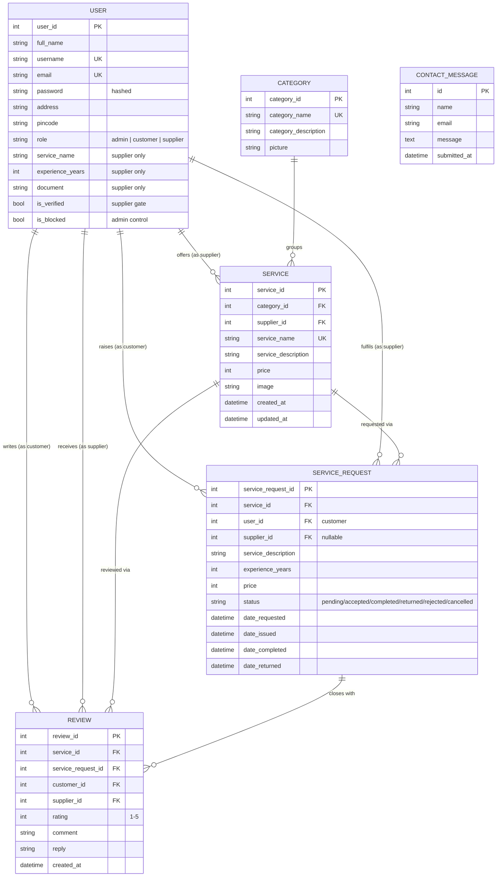
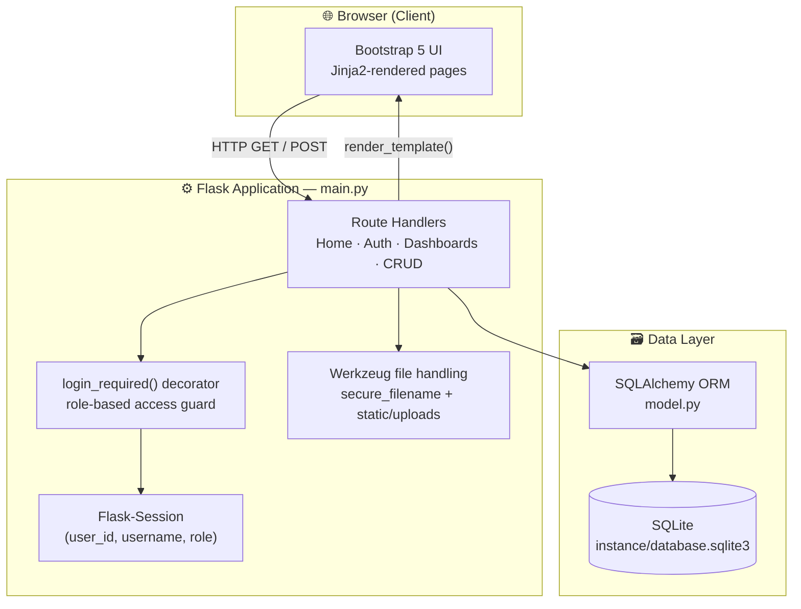
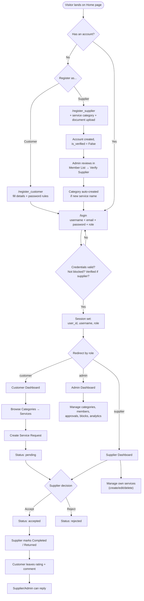
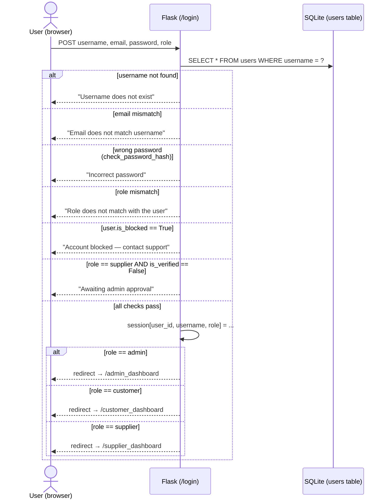

# 🏠 Household Services — MAD Project

**A multi-role Flask web application connecting Customers with verified Suppliers for on-demand household services** — repairs, cleaning, electrical work, salon services, and more — with a built-in Admin control panel for platform governance.


---

## 📑 Table of Contents

1. [Overview](#-overview)
2. [Key Features](#-key-features)
3. [Tech Stack](#-tech-stack)
4. [Project Structure](#-project-structure)
5. [Database Design (ER Diagram)](#-database-design-er-diagram)
6. [Application Architecture](#-application-architecture)
7. [User Roles & Access Control](#-user-roles--access-control)
8. [Application Flow](#-application-flow)
9. [Login & Authentication Flow (Demo Walkthrough)](#-login--authentication-flow-demo-walkthrough)
10. [Configuration Files Explained](#-configuration-files-explained)
11. [Installation & Setup](#-installation--setup)
12. [Creating the First Admin Account](#-creating-the-first-admin-account)
13. [Environment Variables & Security Notes](#-environment-variables--security-notes)
14. [Known Limitations & Future Enhancements](#-known-limitations--future-enhancements)
15. [License](#-license)

---

## 📖 Overview

**Household Services** is a three-sided marketplace web application built with **Flask** and **SQLAlchemy**, developed as a Modern Application Development (MAD) project. It connects three types of users on a single platform:

- **Customers**, who browse service categories, request services, track order status, and leave reviews.
- **Suppliers**, who register to offer a service, get verified by an admin, manage their listings, and fulfil customer requests.
- **Admins**, who approve/reject suppliers, manage categories, block/unblock accounts, moderate reviews, and monitor platform-wide analytics.

The application uses **server-rendered Jinja2 templates** styled with **Bootstrap 5**, session-based authentication, role-based route protection, and a lightweight **SQLite** database — making it self-contained and easy to run locally without any external services.

---

## ✨ Key Features

**Customer**
- Register, log in, and manage a personal profile
- Browse services by category, and search by keyword, location, or supplier name
- Raise a service request against any listed service
- Track requests through *Pending → Accepted → Completed / Returned / Rejected / Cancelled*
- View order details, request history, and a personal analytics summary
- Leave a star rating (1–5) and comment once a request is closed

**Supplier**
- Register with service category, experience, and a verification document (self-employed onboarding)
- Account stays **inactive until an Admin verifies it**
- Once verified, manage their own service listings (create / edit / delete)
- Accept, reject, or complete incoming customer service requests
- Reply to customer reviews
- View a personal performance summary (requests by status, average rating)

**Admin**
- Central dashboard with platform-wide ongoing requests and history
- Approve or reject pending supplier registrations (auto-creates the service **Category** on approval)
- Block / unblock any customer or supplier account
- Create, edit, and delete service categories
- View a member directory (all customers & suppliers) and a contact-message inbox
- Platform-wide analytics: total requests by status, average ratings, blocked-account counts

**Shared / Platform-wide**
- Session-based login with role selection (Admin / Customer / Supplier)
- "Forgot password" self-service reset flow
- File uploads for supplier verification documents, category images, and service images
- Flash-message feedback for every action
- Responsive Bootstrap 5 UI with a consistent navbar/footer across all pages

---

## 🛠 Tech Stack

| Layer              | Technology                                         |
|---------------------|-----------------------------------------------------|
| Backend framework   | Flask 3.0.3                                        |
| ORM                 | Flask-SQLAlchemy 3.1.1 / SQLAlchemy 2.0.35         |
| Session management  | Flask-Session 0.8.0                                |
| Password security   | Werkzeug security (`generate_password_hash`, `check_password_hash`) |
| Database            | SQLite (`instance/database.sqlite3`)               |
| Templating          | Jinja2 3.1.4                                       |
| Frontend            | HTML5, Bootstrap 5.3.3, Font Awesome 5, vanilla JS |
| File handling       | Werkzeug `secure_filename`, local file storage under `static/` |
| Language            | Python 3.x                                         |

---

## 📂 Project Structure

```
Household_Services_MAD_Project/
│
├── main.py                     # Flask application entry point — all routes & business logic
├── model.py                    # SQLAlchemy ORM models (database schema)
├── db.py                       # SQLAlchemy instance/factory shared across the app
├── requirements.txt            # Python dependency list
├── .gitignore                  # Files/folders excluded from version control
│
├── .env/                       # Local Python virtual environment (NOT app secrets — see note below)
│   ├── Scripts/ or bin/        # venv activation scripts
│   └── Lib/                    # installed site-packages
│
├── instance/
│   └── database.sqlite3        # SQLite database file (auto-created on first run)
│
├── static/
│   ├── css/
│   │   └── result.css          # Custom stylesheet overrides
│   ├── documents/              # Sample/reference supplier verification documents
│   ├── images/                 # Static site imagery (homepage hero, default category art)
│   └── uploads/                # User-uploaded content: category images, service images,
│                                # supplier verification documents (saved at runtime)
│
├── templates/
│   ├── base_users.html         # Base layout used by public-facing pages (home, login, register)
│   ├── base_dashboard.html     # Base layout used by authenticated dashboard pages (navbar, footer)
│   ├── home.html               # Public landing page
│   ├── about.html              # About page
│   ├── search_results.html     # Unified search results (categories, services, users)
│   │
│   ├── users/
│   │   ├── login.html                # Role-based login form
│   │   ├── register_customer.html    # Customer sign-up form
│   │   ├── register_supplier.html    # Supplier sign-up form (service, experience, document)
│   │   ├── forgot_password.html      # Forgot-password / reset form
│   │   └── logout.html               # Logout confirmation
│   │
│   ├── dashboard/
│   │   ├── admin_dashboard.html      # Admin's landing dashboard
│   │   ├── customer_dashboard.html   # Customer's landing dashboard
│   │   └── supplier_dashboard.html   # Supplier's landing dashboard
│   │
│   ├── admin/
│   │   └── member_list.html          # Admin: manage customers/suppliers, approve, block
│   │
│   ├── category/
│   │   ├── category_dashboard.html   # Browse all service categories
│   │   ├── create_category.html      # Admin: create a category
│   │   ├── edit_category.html        # Admin/Supplier: edit a category
│   │   └── delete_category.html      # Admin/Supplier: delete a category
│   │
│   ├── service/
│   │   ├── service_dashboard.html    # Browse services within a category
│   │   ├── create_service.html       # Admin/Supplier: create a service listing
│   │   ├── edit_service.html         # Admin/Supplier: edit a service listing
│   │   └── delete_service.html       # Admin/Supplier: delete a service listing
│   │
│   ├── service_requests/
│   │   ├── service_requests.html         # List of ongoing/closed requests (role-aware)
│   │   ├── create_service_request.html   # Customer: raise a new request
│   │   ├── update_service_request.html   # Admin/Supplier: change request status
│   │   ├── delete_service_request.html   # Delete/cancel a request
│   │   └── order_details.html            # Detailed view of a single request
│   │
│   ├── reviews/
│   │   ├── leave_review.html         # Customer: submit rating + comment
│   │   └── view_reviews.html         # View reviews and supplier/admin replies
│   │
│   ├── summary/
│   │   ├── admin_summary.html        # Platform-wide analytics
│   │   ├── customer_summary.html     # Customer's personal request analytics
│   │   └── supplier_summary.html     # Supplier's personal performance analytics
│   │
│   ├── profile/
│   │   ├── profile.html              # View profile
│   │   ├── edit_profile.html         # Edit profile
│   │   └── delete_profile.html       # Delete profile confirmation
│   │
│   └── contact/
│       ├── contact.html              # Public contact form
│       └── view_contact_messages.html # Admin: inbox of submitted contact messages
│
└── __pycache__/                # Python bytecode cache (auto-generated, ignored by git)
```

> **Note on the `.env` folder:** in this project, `.env` is the name given to the **Python virtual environment** directory (created with `python -m venv .env`), *not* a secrets file. It is listed in `.gitignore` and should never be committed. The app's actual secret (`app.secret_key`) is currently hard-coded in `main.py` — see [Security Notes](#-environment-variables--security-notes) for a recommended fix.

---

## 🗄 Database Design (ER Diagram)

The schema is defined with SQLAlchemy ORM models in `model.py` and centers on six tables:



**Design highlights**

- `USER` is a **single table for all three roles** (`admin`, `customer`, `supplier`), differentiated by the `role` column — supplier-only fields (`service_name`, `experience_years`, `document`, `is_verified`) stay `NULL` for customers and admins.
- A `SERVICE` belongs to one `CATEGORY` and one supplier `USER`; deleting a supplier cascades to their services (`ondelete='CASCADE'`).
- A `SERVICE_REQUEST` links a `SERVICE`, the requesting customer, and (once accepted) the fulfilling supplier — its `status` field drives the entire request lifecycle.
- A `REVIEW` is tied 1:1 to a closed `SERVICE_REQUEST` and carries both the customer's rating/comment and an optional supplier/admin `reply`.
- `CONTACT_MESSAGE` is a standalone inbox table fed by the public `/contact` form and read only by admins.

---

## 🏗 Application Architecture



**How it fits together**

1. `main.py` boots the Flask app, wires it to the database via `db.py`, and registers every route.
2. Each protected route is wrapped with the custom `login_required(roles)` decorator, which checks `session['role']` against an allowed list before executing the view.
3. Business logic (form validation, password hashing, file uploads, status transitions) lives directly inside the route functions in `main.py`.
4. `model.py` defines the ORM classes that map Python objects to SQLite tables; `db.py` exposes the shared `SQLAlchemy()` instance used by both `main.py` and `model.py` (avoiding circular imports).
5. Templates extend one of two base layouts — `base_users.html` for public pages and `base_dashboard.html` for authenticated pages — giving the whole app a consistent navbar, flash-message area, and footer.

---

## 🔐 User Roles & Access Control

| Capability                                   | Customer | Supplier | Admin |
|-----------------------------------------------|:--------:|:--------:|:-----:|
| Browse categories & services                  | ✅       | ✅       | ✅    |
| Register / edit / delete own profile           | ✅       | ✅       | ✅    |
| Raise a service request                        | ✅       | —        | —     |
| Accept / reject / complete a service request    | —        | ✅ (own) | ✅ (any) |
| Create / edit / delete own service listings     | —        | ✅ (own) | ✅ (any) |
| Create / edit / delete categories               | —        | edit/delete own | ✅ full |
| Leave a review                                  | ✅       | —        | —     |
| Reply to a review                               | —        | ✅ (own) | ✅ (any) |
| Approve / reject supplier verification          | —        | —        | ✅    |
| Block / unblock user accounts                   | —        | —        | ✅    |
| View member directory & contact inbox           | —        | —        | ✅    |
| View personal performance summary                | ✅       | ✅       | ✅ (platform-wide) |

Access is enforced server-side by the `login_required("role1, role2, ...")` decorator on every sensitive route in `main.py` — a user without a matching session role is redirected to `/login` with a warning flash message.

---

## 🔄 Application Flow

End-to-end journey from account creation to a completed, reviewed service:



---

## 🔑 Login & Authentication Flow (Demo Walkthrough)

The single `/login` page (`templates/users/login.html`) serves **all three roles** — the user explicitly selects **Admin**, **Customer**, or **Supplier** from a dropdown, and must supply a matching `username`, `email`, and `password`.



**Demo — Admin login**
1. Go to `/login`, select **role = Admin**.
2. Enter the admin's `username`, `email`, and `password` (see [Creating the First Admin Account](#-creating-the-first-admin-account) — there is **no public sign-up form for Admin**, it must be seeded directly into the database).
3. On success you land on `/admin_dashboard`, showing platform-wide ongoing requests and history, with **More → Member List**, **Mail Box**, and **Summary** available in the navbar.

**Demo — Customer login**
1. First register via `/register_customer` (full name, username, email, address, pincode, password with complexity rules).
2. Go to `/login`, select **role = Customer**, and sign in immediately — customers do **not** require admin verification.
3. Redirects to `/customer_dashboard` showing ongoing requests and history.

**Demo — Supplier login**
1. First register via `/register_supplier` (choose an existing service category or type a new one, add experience, upload a verification document).
2. The new account is created with `is_verified = False` and **cannot log in yet** — attempting to do so shows *"Your account is awaiting approval from the admin."*
3. An Admin opens **Member List → Waiting Approval** and clicks **Verify**; this flips `is_verified = True` and auto-creates a matching `Category` if the supplier's service name is new.
4. The supplier can now log in via `/login` (role = Supplier) and lands on `/supplier_dashboard`.

**Forgot password:** `/forgot_password` validates a matching username + email pair, then `/set_new_password` re-hashes and saves the new password — no email delivery is involved; it is a direct in-app reset.

---

## ⚙️ Configuration Files Explained

| File | Purpose |
|------|---------|
| `main.py` | The Flask application itself: app config, `UPLOAD_FOLDER`, allowed file extensions, every `@app.route`, and the `if __name__ == '__main__':` block that calls `db.create_all()` and starts the dev server. |
| `model.py` | All SQLAlchemy models (`User`, `Category`, `Service`, `ServiceRequest`, `Review`, `ContactMessage`) with their columns, relationships, and constructors. |
| `db.py` | Instantiates a single shared `SQLAlchemy(model_class=Base)` object, imported by both `main.py` (to bind it to the Flask app) and `model.py` (to define models) — this indirection avoids circular imports. |
| `requirements.txt` | Pinned Python package versions needed to run the app (Flask, Flask-SQLAlchemy, Flask-Session, Werkzeug, Jinja2, etc.). |
| `.gitignore` | Excludes the `.env` virtual-environment folder, `__pycache__/`, compiled `*.pyc` files, and the `.codegpt` folder from version control. |
| `instance/database.sqlite3` | The actual SQLite database file — auto-generated the first time the app runs (`db.create_all()`); safe to delete to reset all data. |
| `static/` | All served static assets — CSS, homepage imagery, and the runtime upload destination for category pictures, service images, and supplier documents. |
| `templates/` | All Jinja2 HTML templates, organized by feature area (see [Project Structure](#-project-structure)). |

---

## 🚀 Installation & Setup

**Prerequisites:** Python 3.9+ and `pip` installed.

```bash
# 1. Clone the repository
git clone <your-repository-url>
cd Household_Services_MAD_Project

# 2. Create and activate a virtual environment
python -m venv .env

# Windows
.env\Scripts\activate

# macOS / Linux
source .env/bin/activate

# 3. Install dependencies
pip install -r requirements.txt

# 4. Run the application
python main.py
```

The app starts in debug mode on **http://127.0.0.1:5000/**. On first run, `db.create_all()` automatically creates `instance/database.sqlite3` with all required tables — no manual migration step is needed.

---

## 👤 Creating the First Admin Account

There is **no public registration route for Admin** (only `/register_customer` and `/register_supplier` exist) — this is intentional, so platform admins can't be self-signed-up. Create the first admin directly against the database using a short Python script, run from the project root (with the virtual environment active):

```python
from main import app
from db import db
from model import User
from werkzeug.security import generate_password_hash

with app.app_context():
    admin = User(
        full_name="Platform Admin",
        username="admin",
        email="admin@example.com",
        password=generate_password_hash("Admin@123"),   # meets the app's password rules
        address="HQ Office",
        pincode="000000",
        role="admin"
    )
    db.session.add(admin)
    db.session.commit()
    print("Admin account created.")
```

Save this as e.g. `create_admin.py` in the project root and run `python create_admin.py` once. You can then log in at `/login` with `role = Admin` using the credentials above.

> Password rule enforced across the app: minimum one uppercase, one lowercase, one digit, and one special character.

---

## 🔒 Environment Variables & Security Notes

This project currently favors simplicity for demo/academic purposes. Before any real deployment, consider:

- **Secret key:** `app.secret_key = 'your_secret_key'` is hard-coded in `main.py`. Move it to an environment variable, e.g. `app.secret_key = os.environ.get("SECRET_KEY")`, and load it from a real `.env` **secrets** file (using `python-dotenv`) — distinct from the `.env` virtual-environment folder already present in this repo. Consider renaming the venv folder (e.g. `venv/`) to avoid confusion with a future secrets file.
- **Debug mode:** `app.run(debug=True)` should be disabled (`debug=False`) in production — debug mode exposes the interactive Werkzeug debugger and stack traces.
- **Database:** SQLite is fine for development; a production deployment should move to PostgreSQL/MySQL.
- **Uploads:** Uploaded files are validated by extension only (`ALLOWED_EXTENSIONS`); consider adding size limits and content-type verification.
- **Passwords:** Already hashed correctly via Werkzeug's `generate_password_hash` / `check_password_hash` — no changes needed here.

---

## 🧭 Known Limitations & Future Enhancements

- No email delivery for password resets (currently an in-app username+email verification, not a mailed token link).
- No pagination on member lists / service listings — fine for demo data volumes, worth adding for scale.
- No automated test suite yet — consider adding `pytest` coverage for route access control and status transitions.
- No REST/JSON API — the app is fully server-rendered; a future iteration could expose an API layer for a mobile client.
- Category/service uniqueness is enforced by name, which can be restrictive — consider composite uniqueness (name + supplier) if suppliers should be allowed to reuse names across categories.

---

## 📄 License

This project is provided for academic/demonstration purposes as part of a Modern Application Development (MAD) coursework project. Add a formal license (e.g., MIT) here if you intend to distribute or open-source the code.

---

<p align="center"><em>Built with Flask, SQLAlchemy, and Bootstrap 5 — designed to demonstrate a full role-based service marketplace workflow end-to-end.</em></p>
